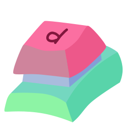

  

 

    
    

 

# Dactyl Web Configurator

A web configurator for the Dactyl mechanical keyboard.
It's based upon the wonderful work of @ibnuda's [web configurator](https://github.com/ibnuda/dactyl-keyboard), which organizes the configuration options in various commuity edits to a single JSON structure.

The site uses ClojureScript and WebAssembly to run all computation in the browser. This means I don't have to pay for expensive servers to render everyone's cad models!

The new developments of this work are:
- All Clojure source files have been translated to [ClojureScript](https://clojurescript.org), which can easily be run in the browser. The two languages are extremely similar, but there are a few key differences (lack of ratios, macro handling) that need to be taken into account.
- ~~Using @DSchroer's [WebAssembly build of OpenSCAD](https://github.com/DSchroer/openscad-wasm), STL generation can happen entirely within the browser.~~ The latest release uses the [Manifold](github.com/elalish/manifold) geometry kernel instead, which produces renders almost 100x faster! Using OpenSCAD is still left as an option.
- Fast CSG previews are generated using ~~the [OpenJSCAD project](https://github.com/jscad/OpenJSCAD.org). I've added a new back end to the [scad-clj](https://github.com/farrellm/scad-clj) library (which has been copied into this project due to how heavily I've edited it) to generate the OpenJSCAD objects.~~ Since Manifold is such a fast kernel, it is also used for previews. I've written an interop layer to give Manifold the same API as OpenJSCAD.
- CSGs are previewed with Three.JS, using the [Svelte-cubed](https://svelte-cubed.vercel.app) bindings.
- The ClojureScript source files are compiled into a web worker, which is run from [Svelte](https://svelte.dev)/TypeScript frontend.
- Configurations are compressed with [protobuf](https://protobuf.dev) and saved to the URL. This makes it easy to share configurations with others. I've also switched to using camelcase for the JSON configuration, which makes integrating with protobuf easier.
- The SCAD output is verified to match that generated by @tshort's original Manuform generator when using settings matching the original and turning off adjustments made by @ibnuda to the thicknesses & dimensions.
- Confusing options have help information explaining what they do.
- I've made a few edits to the presets and Dactyl code to create better default models. These include making TRRS jacks the default instead of RJ9, removing the Pro Micro holder since it rarely correctly attaches to the side of the case, and fixing the TRRS holder so that it's attached to the case.

## Building and running

You'll first need to install Node.js dependencies with `npm install`.
ClojureScript and protobuf files can then be built with the Makefile. After you've installed a Java runtime (for compiling ClojureScript) ~~and the [protobuf compiler](https://grpc.io/docs/protoc-installation/)~~ (it's installed by `npm install`), run `make` to compile the files.

They compiled files are placed in the `target` directory. To build the website, run `npm run dev`.

### Useful Resources
- [ClojureScript interop with javascript](https://lwhorton.github.io/2018/10/20/clojurescript-interop-with-javascript.html)
- [JSCAD user guide](https://openjscad.xyz/dokuwiki/doku.php)
- [The Noble Effort To Put OpenSCAD In The Browser](https://hackaday.com/2022/03/14/the-noble-effort-to-put-openscad-in-the-browser/)

## What are all these files?
- `index.html` and `public/`: Static files used for the website
- `scripts/`: Node.js scripts for testing and developing new features
- `src/`: Source code
  - `assets/`: Models, JSON configuration, and WebAssembly files used by the frontend
  - `cljs/`: ClojureScript source code
    - `dactyl_generator`: Generate the Dactyl models. Most notably: `manuform.cljs`
    - `dactyl_node`: Entry point for generating Dactyl models from Node.js and the browser
    - `scad_clj`: My modifications to the scad-clj library (simplifies outputting scad code)
  - `lib`: Components and methods used by the frontend
  - `proto`: Protobuf definitions
